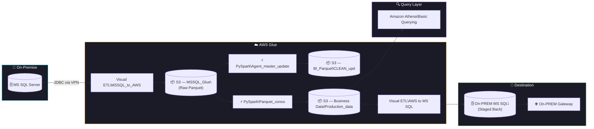
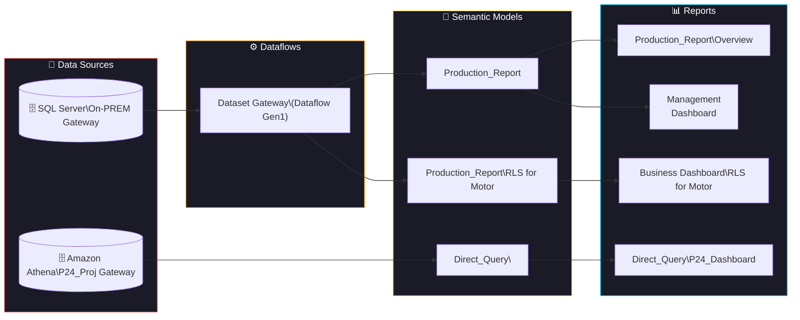

<div align="center">


[](https://linkedin.com/in/mangesh--jadhav)
&nbsp;
[](mailto:mangeshjadhav948@gmail.com)
&nbsp;
[](https://github.com/Mangesh-Jadhav-2)

</div>

---

### 🧑‍💼 About Me

```yaml
Name:       Mangesh Jadhav
Role:       Data Analyst @ Probus Insurance
Education:  Executive MBA — IT & Analytics
Domain:     BFSI & Analytics
Focus:      Data Infrastructure · Cloud Analytics · Business Intelligence
```

- 🔹 Automated ETL pipelines achieving **70% performance improvement** in data processing throughput
- 🔹 Designed AWS Data Warehouse architectures using **S3 → Glue → Redshift**
- 🔹 Built **Power BI dashboards** with advanced DAX measures and semantic data models
- 🔹 Proficient in optimized SQL — parameterized CTEs, window functions, complex joins on multi-million row datasets

---

### 🛠️ Tech Stack

<div align="center">

#### 📦 Databases


#### ⚙️ Data Engineering


#### 📊 BI & Visualization


#### ☁️ Cloud & Infrastructure


</div>

---

### 🚀 Featured Projects

<table>
<tr><td>

#### 📈 [Analytics EDA Project](https://github.com/Mangesh-Jadhav-2/Analytics-EDA-Project)

> End-to-end Exploratory Data Analysis pipeline for multi-dimensional BFSI data profiling

**Stack:** `Python` · `Pandas` · `NumPy` · `Matplotlib` · `Seaborn` · `SQL`

- Parameterized CTEs for reusable SQL query patterns
- Window functions for rolling aggregations & trend analysis
- Automated data quality checks across 20+ feature columns
- Outlier detection using IQR & Z-score methods
- Built reusable profiling templates — **reduced EDA effort by 60%**

</td></tr>
<tr><td>

#### 🤖 [RAG Reporting System](https://github.com/Mangesh-Jadhav-2/RAG-Reporting-System)

> For automated analytical report generation

**Stack:** `Python` · `LangChain` · `OpenAI API` · `SQL` · `Pandas` · `Jinja2`

- Semantic layer abstraction decoupling business logic from physical data models
- LLM-powered narrative generation with parameterized prompts
- Automated weekly report generation — **reduced manual effort by 80%**

</td></tr>
<tr><td>

#### 📊 [Performance Analytics Dashboard](https://github.com/Mangesh-Jadhav-2/Performance-Analytics-Dashboard)

> Enterprise KPI tracking dashboard for insurance analytics at Probus Insurance

**Stack:** `Power BI` · `DAX` · `MS SQL Server` · `Excel` · `Power Query`

- Star-schema data model (facts: transactions, claims; dimensions: agents, products, time)
- 15+ interactive reports with drill-through navigation
- Time-intelligence DAX measures — YTD, QoQ, Weighted, Rolling averages
- Row-level security (RLS) for multi-tenant access
- Incremental refresh for near-real-time reporting

</td></tr>
</table>

---

### 📐 End-to-End Data Pipeline Architecture

> *Actual production architecture built at Probus Insurance*

#### ⚙️ AWS Glue — ETL & Data Processing Layer



#### 📊 Power BI — Semantic Model & Report Layer


---

<div align="center">

### 🤝 Let's Connect

💼 **Open to collaboration** on Data Infrastructure, Cloud Analytics, and BI projects

[](https://linkedin.com/in/mangesh--jadhav)
&nbsp;&nbsp;
[](mailto:mangeshjadhav948@gmail.com)

<br/><br/>

*"Exploring data, building dashboards and uncovering insights that matter."*

</div>


