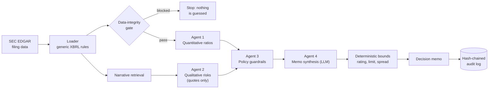
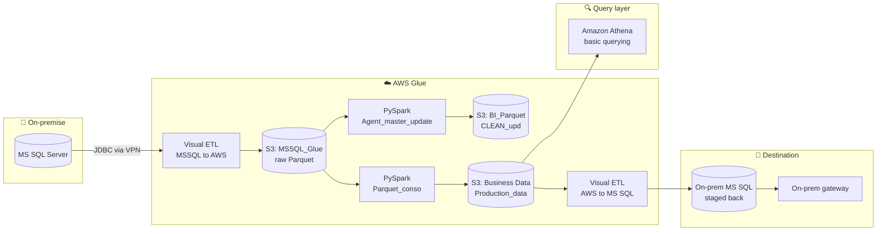
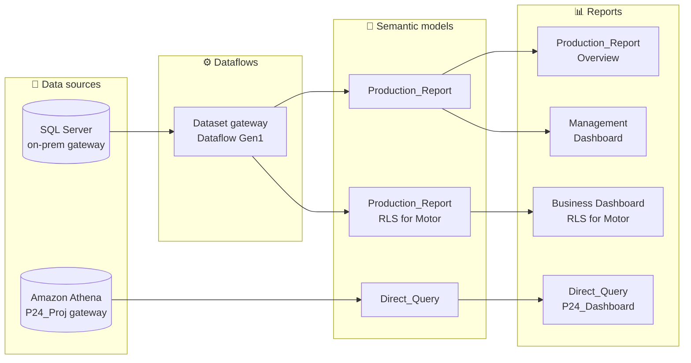

# Mangesh Jadhav

### Data & Analytics · BI · Cloud Data Engineering · Agentic AI

**I turn messy financial and insurance data into pipelines, dashboards and decisions that people can trust.**

&nbsp;

&nbsp;

---

## 👋 At a glance

| Area | Details |
|:--|:--|
| 🎯 **Focus** | Data infrastructure · Cloud analytics · Business intelligence · Agents |
| 🏦 **Domain** | BFSI: insurance broking, banking operations, credit |
| 🧰 **Core tools** | Python · SQL · AWS (S3, Glue, Redshift) · Power BI & DAX · LangGraph |
| 🎓 **Education** | Executive MBA in IT & Analytics, SIMS Pune (2027) · BMS in Finance, Sydenham College |
| 📍 **Based in** | Mumbai, India |

### What I bring

- ⚡ Automated ETL pipelines with a **70% improvement in data-processing throughput**
- ☁️ AWS data-warehouse designs on **S3 → Glue → Redshift**
- 📊 **Power BI** dashboards with advanced DAX, star-schema models and row-level security
- 🧮 Optimised SQL: parameterised CTEs, window functions, complex joins on multi-million-row datasets
- 🤖 Agentic AI for finance, with deterministic guardrails around the LLM

---

## 🏆 Flagship project: Agentic Credit Underwriting Engine

**[View the repository →](https://github.com/Mangesh-Jadhav-2/agentic-credit-underwriter)**

An AI underwriting prototype that reads a company's **latest SEC annual filing (10-K / 20-F)**, computes credit ratios, applies bank-style policy guardrails, reads the filing's risk disclosures, and produces a **rated, priced credit memo** with every step recorded in a tamper-evident audit log.

> **The design idea:** the LLM writes and reasons; **deterministic code decides what the bank is allowed to approve.**

```mermaid
flowchart LR
    A["SEC EDGAR<br/>filing data"] --> B["Loader<br/>generic XBRL rules"]
    B --> C{"Data-integrity<br/>gate"}
    C -- "blocked" --> X["Stop: nothing<br/>is guessed"]
    C -- "pass" --> D["Agent 1<br/>Quantitative ratios"]
    B --> N["Narrative retrieval"]
    N --> E["Agent 2<br/>Qualitative risks<br/>(quotes only)"]
    D --> F["Agent 3<br/>Policy guardrails"]
    E --> F
    F --> H["Agent 4<br/>Memo synthesis (LLM)"]
    H --> I["Deterministic bounds<br/>rating, limit, spread"]
    I --> J["Decision memo"]
    J --> K[("Hash-chained<br/>audit log")]
```

| Risk with a naive "LLM underwriter" | How this project handles it |
|:--|:--|
| Missing numbers silently defaulted | A **data-integrity gate** blocks the case or refers it to an analyst |
| Model proposes a limit or price outside policy | **Deterministic rules** cap rating, limit and spread *after* the LLM answers |
| Model invents risks | Every risk must **quote the filing word for word**; ungrounded findings are dropped |
| "Who decided what, using which data?" | **Hash-chained audit log** of inputs, policy version, model and overrides |

**Stack:** `Python` · `LangGraph` · `Groq LLM` · `Pydantic v2` · `Streamlit` · `lxml` · `SEC EDGAR APIs` · **113 automated tests**

---

## 🚀 More projects

<table>
<tr><td>

#### 📈 [Analytics EDA Project](https://github.com/Mangesh-Jadhav-2/Analytics-EDA-Project)

> End-to-end exploratory data analysis pipeline for multi-dimensional BFSI data profiling

**Stack:** `Python` · `Pandas` · `NumPy` · `Matplotlib` · `Seaborn` · `SQL`

- Parameterised CTEs and window functions for reusable query patterns and trend analysis
- Automated data-quality checks across 20+ feature columns; outlier detection with IQR and Z-score
- Reusable profiling templates that **reduced EDA effort by 60%**

</td></tr>
<tr><td>

#### 🤖 [RAG Reporting System](https://github.com/Mangesh-Jadhav-2/RAG-Reporting-System)

> Red-Amber-Green performance tracking with predictive analytics powered by ML and an LLM

**Stack:** `Python` · `LangChain` · `scikit-learn` · `Pandas` · `SQL` · `Power BI`

- RAG status classification for KPI health monitoring
- Classification and regression models (Logistic Regression, Random Forest, XGBoost), plus trend forecasting and anomaly detection
- LangChain narrative generation and automated weekly reports that **cut manual reporting effort by 80%**

</td></tr>
<tr><td>

#### 📊 [Performance Analytics Dashboard](https://github.com/Mangesh-Jadhav-2/Performance-Analytics-Dashboard)

> Enterprise KPI tracking dashboard for insurance analytics

**Stack:** `Power BI` · `DAX` · `MS SQL Server` · `Excel` · `Power Query`

- Star-schema model (facts: transactions, claims; dimensions: agents, products, time)
- Time-intelligence DAX (YTD, QoQ, weighted, rolling averages) with drill-through reports
- Row-level security for multi-tenant access and incremental refresh for near-real-time reporting

</td></tr>
</table>

---

## 💼 Experience

| Role | Where | When | What I did |
|:--|:--|:--|:--|
| **Data Analyst** | Probus Insurance Broker Pvt. Ltd., Mumbai | Mar 2024 – Mar 2026 | Built the ETL, AWS warehouse and Power BI reporting stack for insurance production and management reporting (architecture below) |
| **KYC Analyst** | RBL Bank, Mumbai | Apr 2022 – Jan 2024 | Customer due diligence and KYC compliance in retail banking |

**Learning:** Microsoft Power BI Data Analyst (PL-300), in progress · **Certified:** Data Science & AI (Intellipaat) · Google Analytics

---

## 🛠️ Tech stack

#### 🤖 AI & Applications

#### ⚙️ Data Engineering

#### 📦 Databases

#### 📊 BI & Visualisation

#### ☁️ Cloud & Infrastructure

---

## 📐 Production data architecture

> *The pipeline architecture I built at Probus Insurance. Expand to view.*

<b>⚙️ AWS Glue: ETL and data-processing layer</b>

```mermaid
flowchart LR
    subgraph ONPREM["🏢 On-premise"]
        MSSQL[("MS SQL Server")]
    end

    subgraph AWS_GLUE["☁️ AWS Glue"]
        direction TB
        ETL1["Visual ETL<br/>MSSQL to AWS"]
        S3_RAW[("S3: MSSQL_Glue<br/>raw Parquet")]
        SPARK1["PySpark<br/>Parquet_conso"]
        SPARK2["PySpark<br/>Agent_master_update"]
        S3_CLEAN[("S3: BI_Parquet<br/>CLEAN_upd")]
        S3_BIZ[("S3: Business Data<br/>Production_data")]
        ETL2["Visual ETL<br/>AWS to MS SQL"]
    end

    subgraph QUERY["🔍 Query layer"]
        ATHENA["Amazon Athena<br/>basic querying"]
    end

    subgraph DEST["🏢 Destination"]
        MSSQL2[("On-prem MS SQL<br/>staged back")]
        GW["On-prem gateway"]
    end

    MSSQL -- "JDBC via VPN" --> ETL1
    ETL1 --> S3_RAW
    S3_RAW --> SPARK1
    S3_RAW --> SPARK2
    SPARK1 --> S3_BIZ
    SPARK2 --> S3_CLEAN
    S3_BIZ --> ATHENA
    S3_BIZ --> ETL2
    ETL2 --> MSSQL2
    MSSQL2 --> GW
```

<b>📊 Power BI: semantic model and report layer</b>

```mermaid
flowchart LR
    subgraph SOURCES["🔌 Data sources"]
        SQL[("SQL Server<br/>on-prem gateway")]
        ATH[("Amazon Athena<br/>P24_Proj gateway")]
    end

    subgraph TRANSFORM["⚙️ Dataflows"]
        DF["Dataset gateway<br/>Dataflow Gen1"]
    end

    subgraph MODELS["📐 Semantic models"]
        SM1["Production_Report"]
        SM2["Production_Report<br/>RLS for Motor"]
        SM3["Direct_Query"]
    end

    subgraph REPORTS["📊 Reports"]
        R1["Production_Report<br/>Overview"]
        R2["Management<br/>Dashboard"]
        R3["Business Dashboard<br/>RLS for Motor"]
        R4["Direct_Query<br/>P24_Dashboard"]
    end

    SQL --> DF
    DF --> SM1
    DF --> SM2
    SM1 --> R1
    SM1 --> R2
    SM2 --> R3
    ATH --> SM3
    SM3 --> R4
```

---

## 🤝 Let's connect

Open to collaboration on **data infrastructure, cloud analytics, BI and agentic-AI projects** in finance and insurance.

&nbsp;&nbsp;

&nbsp;&nbsp;

 

*Exploring data, building dashboards and uncovering insights that matter.*

